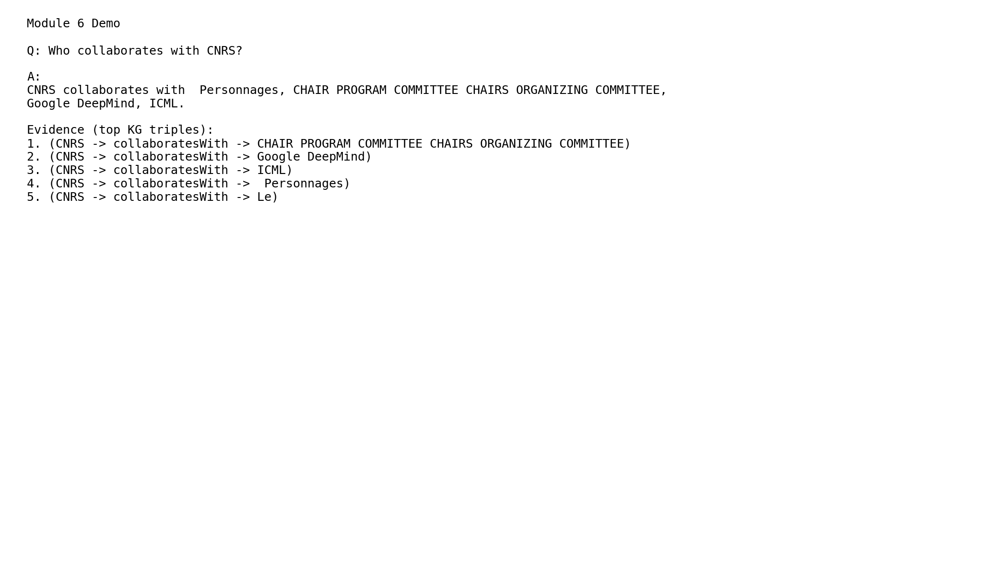

# Knowledge Graph Pipeline for Web Datamining and Semantics

This project implements a complete end-to-end pipeline that transforms unstructured web text into a structured Knowledge Graph (KG), applies reasoning and embeddings, and delivers a KG-grounded Retrieval-Augmented Generation (RAG) demo.

The repository is organized for academic submission and reproducibility, with clear module boundaries and final evaluation artifacts.

## Project Description

The system covers six modules:

1. Web crawling and entity extraction from raw documents.
2. KG construction, alignment, and schema organization.
3. KG expansion and enrichment with additional relations.
4. Rule-based reasoning to infer new triples.
5. Knowledge Graph Embeddings (KGE) with TransE optimization.
6. KG-grounded RAG demo with NL-to-SPARQL, self-repair, and evaluation.

## Pipeline Overview (6 Modules)

1. **Module 1: Crawling + NER**
Collects raw content and extracts entities/mentions.

2. **Module 2: KG Construction**
Builds core triples, aligns entities, and creates the base graph.

3. **Module 3: Expansion**
Adds synthetic/derived relations and enriches graph structure.

4. **Module 4: Reasoning**
Applies SWRL-style reasoning rules and writes inferred triples.

5. **Module 5: KGE**
Trains embedding models (TransE/DistMult), performs optimization, and reports ranking metrics.

6. **Module 6: RAG Demo**
Converts NL questions to SPARQL, executes KG queries with retry/repair, and returns explainable answers with supporting triples.

## Installation

### Python Version

- Recommended: `Python 3.10+`
- Validated in this workspace with: `Python 3.14.3`

### Dependencies

```bash
pip install -r requirements.txt
```

## How to Run Each Module

### Module 1: Crawling + NER

```bash
python src/crawl/run_module1.py
python src/ie/ner.py
```

### Module 2: KG Construction

```bash
python src/kg/module2_pipeline.py
python src/kg/run_step3.py
```

### Module 3: Expansion

```bash
python src/kg/run_step5.py
python src/kg/run_module3_enrichment_enhanced.py
```

### Module 4: Reasoning

```bash
python src/reason/run_module4_reasoning.py
```

### Module 5: KGE

```bash
python src/kge/run_module5.py
python src/kge/run_module5_optimize.py
```

### Module 6: RAG Demo

```bash
python rag/demo.py --eval
```

## How to Run RAG Demo (CLI)

Single question:

```bash
python rag/demo.py --question "Who collaborates with CNRS?"
```

With evaluation (5 questions):

```bash
python rag/demo.py --eval
```

Output files:

1. `rag/eval_results.json`
2. `rag/demo_screenshot.png`

## Ollama Setup (Local LLM Backend for RAG)

Install Ollama:

1. Download from: `https://ollama.com/download`
2. Install for your OS.

Pull and run a model:

```bash
ollama pull llama3.1:8b
ollama run llama3.1:8b
```

In this project workflow, Ollama can be used as the local generation backend while final answers stay grounded in SPARQL KG evidence.

## Results Summary

### KGE (Module 5)

Best model: **TransE (optimized, KB + inferred triples)**

1. `MRR = 0.3719`
2. `Hits@1 = 0.1604`
3. `Hits@3 = 0.5377`
4. `Hits@10 = 0.7358`

Second model (DistMult, full split):

1. `MRR = 0.0162`
2. `Hits@1 = 0.0000`
3. `Hits@3 = 0.0200`
4. `Hits@10 = 0.0400`

Improvement highlights:

1. Baseline TransE MRR: `0.0996`
2. Final TransE MRR: `0.3719`
3. Inferred triples improved over tuned base by `+0.0210` MRR

Source file:

1. `reports/KG_Pipeline_Final_Report.pdf`

### RAG Evaluation (Module 6)

From `rag/eval_results.json`:

1. Number of questions: `5`
2. KG query success rate: `1.00`
3. Average supporting triples: `4.6`

This demonstrates that answers are KG-grounded and explainable (not free-text only).

## Demo Screenshot



## Repository Structure

```text
project-root/
├─ src/
│ ├─ crawl/
│ ├─ ie/
│ ├─ kg/
│ ├─ reason/
│ ├─ kge/
│ └─ rag/
├─ data/
│ ├─ samples/
│ └─ README.md
├─ kg_artifacts/
│ ├─ ontology.ttl
│ ├─ expanded.nt
│ └─ alignment.ttl
├─ reports/
│ └─ KG_Pipeline_Final_Report.pdf
├─ notebooks/
├─ README.md
├─ requirements.txt
├─ .gitignore
└─ LICENSE
```

## Hardware Requirements

Minimum (CPU-only):

1. CPU: 4 cores
2. RAM: 8 GB
3. Storage: 5 GB free

Recommended:

1. CPU: 8+ cores
2. RAM: 16 GB
3. GPU: Optional for faster embedding experiments

## Final Submission and Release Workflow

Use these commands to finalize the repository:

```bash
git add .
git commit -m "Final submission: Knowledge Graph pipeline with KGE and RAG"
git push origin main

git tag v1.0-final
git push origin v1.0-final
```

Create a GitHub Release:

1. Title: `v1.0-final`
2. Description:
	- Full KG pipeline implementation
	- KGE results
	- RAG demo
	- Final report included
